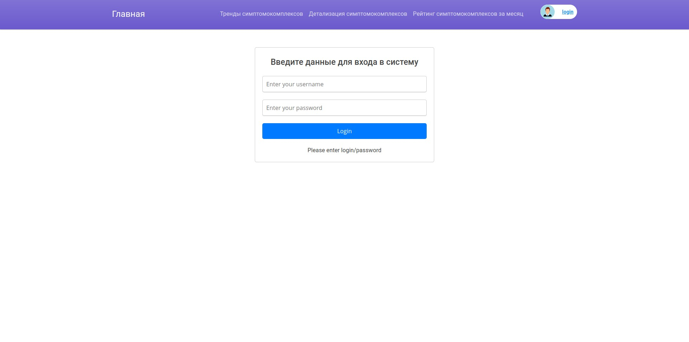

# disease-trend-system


## Описание

Заказчик ПО: Алексей Владимирович Тарасов - научный сотрудник института автоматики ДВО РАН.

Описание задачи:
1. Существует три сервиса (подсистемы), которые взаимодействуют между собой (подсистема ввода жалоб пациента, подсистема распознавания симптомокомлексов, подсистема **анализа трендов**);
2. Интеграция между двумя подсистемами представляется по REST API;
3. Тренд формируется на основе увлечения или уменьшения симптомокомлексов на определенных промежутках;

* **Тестовые данные для сервиса генерируются нами(разработчиками)**

```
Примечание: Данные тренда берутся из второй подсистемы. 

```

* **Сотрудники инфраструктуры имеют компетенции для разрвертывания и сопровождения системы такие, как MySQL, Docker, Docker-compose.** 

Алгоритм добавления нового симптомокомплекса:
1. Парсим JSON файл в словарь;
2. Преобразуем всё текстовое в нижни регистр, сортируем ключи
3. Высчитываем хеш MD5
4. Если такой хеш существует в БД, сохраняем, иначе выполняем "поиск пересечений" по хешу.
5. Если есть совпадение +-1 признак, то сохраняем с таким же ключом как у найденного симптомокомлекса и сохраняем со своим личным хешом;
6. Иначе просто вставка;
7. 

* **Описание входных данных в сервис**
Симптомокомплексы - совокупность признаков и процент людей (которые встречаются минимум у 30%).

**Шаблон описания симптомокомплекса в программе:**
***
| Признаки                  | Значение       |
| ------------------------- | -------------- |
| Симптом                   | Название       |
| Процент пациентов         | Процент        |
| Общее количество людей    | Число          |
| Дата регистрации симптома | Дата и время   |
| Город                     | Строковое(128) |
| Район                     | Строковое(128) |
| Мед.учреждение            | Строковое(128) |

***Визуализация трендов* - простой график трендов**

Пример
| Признаки                           | Значение           |
| ---------------------------------- | ------------------ |
| Температура                        | Супфидрильная      |
| Головная боль                      | Есть               |
| Стреляет в спину                   | Есть               |
| Процент людей c симптомокомплексом | 30                 |
| Общее число людей                  | 100                |
| Дата выявленного симптомокопмлекса | 30-03-2023         |
| Город                              | Владивосток        |
| Район                              | Первореченский     |
| Мед. учреждение                    | Первая поликлиника |


**Порог тренда** - количество дней продолжительности тренда;


* **Описание выходных данных из сервиса**
1. Тренды симптомокомлекса;
2. Детализация симптомокомлекса (страница симптомокомлексов);
3. Отчёт с рейтингом симптомокомлексов);

* **Правила построения тренда;**
Пользователь задаёт параметр жизни симптомокомплекса по умолчанию 5 дней.
Если не увеличивается - выкидывается.
Если уменьшается в течении 5 дней - выкидываем.
Если увеличивается - присваиваем временные метки динамики.
Если из 5 дней 3 дня идут на увелечение или стоячий - это тренд.
Если не тренд в течении 5 дней - это уже не является трендом и удаляется.

Система мониторинга в течении определенного промежутка времени.

Важно:
Если симптомокомлекс пересекается по 3-м и более признакам с другим симптомокомлексом (является надмножеством), помечать их как похожие симптомокомлексы. При учете тренда похожие симптомокомлексы дублировать в разные тренды.

Хранить хеш самого симптомокомлекса, каждая строка - это ключ, значение симптомокомлекса

Пример:
Начало недели симптомокомплекс 5 человек  - конец недели симптомокомплекс 100 человек;

```
Примечание: симтомокомлекс считается похожим если он отличается на 1-2 признака (можно сделать параметром)
```

## Описание API

Данный сервис имеет всего лишь одну точку входа. Добавление симптомокомлекса.
Все параметры являются обязательными

**POST: /symptoms**

**Тело запроса:**
```
{
    "symptoms": {
        "Название признака 1": str | int | float,
        "Название признака 2": str | int | float,
        ...
        "Название признака N": str | int | float,
    },
    "percent_people": float,
    "total_number_people": int+,
    "date_symptoms": "datetime iso format",
    "city": str,
    "region": str,
    "hospital": str
}
```
**Пример CURL**
```
curl -X POST http://localhost:8050/symptoms -H 'Content-Type: application/json' -d {
    "symptoms": {
        "Насморок": "Обильный",
        "Температура": "Адская",
        "Коленостреляние": "Дробью"
    },
    "percent_people": 22.2,
    "total_number_people": 102,
    "date_symptoms": "2023-03-04T00:00:00",
    "city": "Караганда",
    "region": "Карагандийский",
    "hospital": "Внадеждевыживальский район"
}
```

## Структура проекта
```
├── disease_trend_system
│   ├── app.py - конфигурация Flask приложения
│   ├── assets
│   │   ├── images
│   │   │   ├── picture_3.jpeg
│   │   │   └── picture_4.jpeg
│   │   └── style.css
│   ├── callbacks - колбэки для дашбордов
│   │   ├── auth_callbalcks.py
│   │   ├── raiting_callbacks.py
│   │   ├── trends_callbacks_detail.py
│   │   └── trends_callbacks.py
│   ├── config.py - конфиг приложения
│   ├── endpoints.py - API Flask-Restful
│   ├── layouts - UI компоненты приложения
│   │   ├── auth_layout.py
│   │   ├── navbar.py
│   │   ├── raiting_layout.py
│   │   ├── trends_layout_detail.py
│   │   └── trends_layout.py
│   ├── models.py - Модели приложения
│   ├── services - Сервисы бизнес логики
│   │   ├── create_data_trend.py
│   │   ├── fake_name_service.py
│   │   ├── symptom_complexes_dao.py
│   │   └── symptom_complex_transform.py
│   └── templates - Шаблоны админ. панели
│       ├── admin
│       │   └── index.html
│       └── my_master.html
├── docker-compose.yaml
├── Dockerfile
├── docs
├── LICENSE
├── main.py
├── poetry.lock
├── pyproject.toml
├── README.md
└── tests - тесты
    ├── cities
    ├── hospitals
    ├── load_fixtures.py - загрузка фикстур в БД
    ├── regions
    └── symptoms
```

## Как развернуть для разработки

```ssh
docker-compose up -d
```

Целевой платформой является linux, для развертывание контейнера на машине необходимо наличие актуальной версии docker-engine а также git.

##  Развернуть в прод (БД persistance)

```bash
git clone https://github.com/DieNice/disease-trend-system.git
cd disease-trend-system
```

```bash
docker build . --tag trend-system:latest
```
```bash
docker run -d --rm -e HOSTNAME_DB=disease-trend-system_db_1 -e USERNAME_DB=developer -e PASSWORD_DB=dev_password -e NAME_DB=disease-trend -e SERCRET_KEY=super_secret_key -p 8050:8050 --name trend-system-container trend-system:latest
```

## Описание секретов

  * **HOSTNAME_DB** - ip адрес базы данных
  * **USERNAME_DB** - имя пользователя владеющего правами доступа к базе данных
  * **PASSWORD_DB** - пароль пользователя
  * **NAME_DB** - название базы данных
  * **SERCRET_KEY** - ключ шифрования
  *  **ADMIN_NAME** - admin_name
  *  **ADMIN_USERNAME** - admin_username
  *  **ADMIN_PASSWORD** - admin_password
  *  **ADMIN_EMAIL** - admin_email@mail.ru

## Административная панель

Административная панель доступна по адресу /admin, но перед этим необходимо залогиниться через учетную запись администратора.

При первом запуске создается учетная запись администратора с данными, указанными из секретов описанных выше.

При любом изменении пароля он автоматически хешируется 




